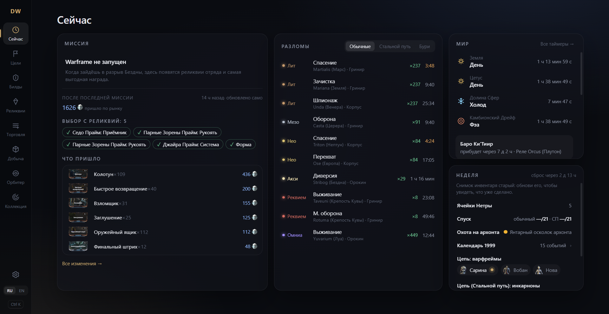
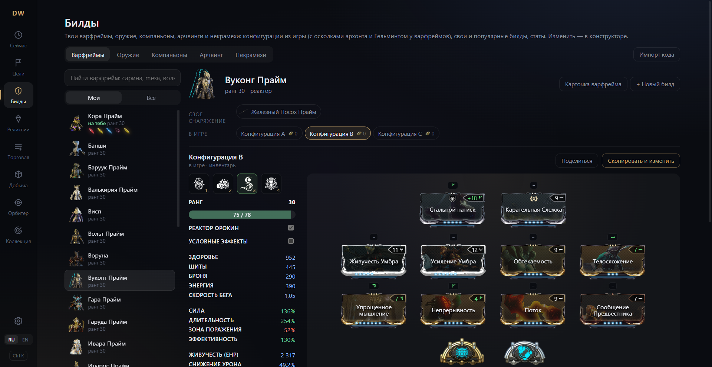
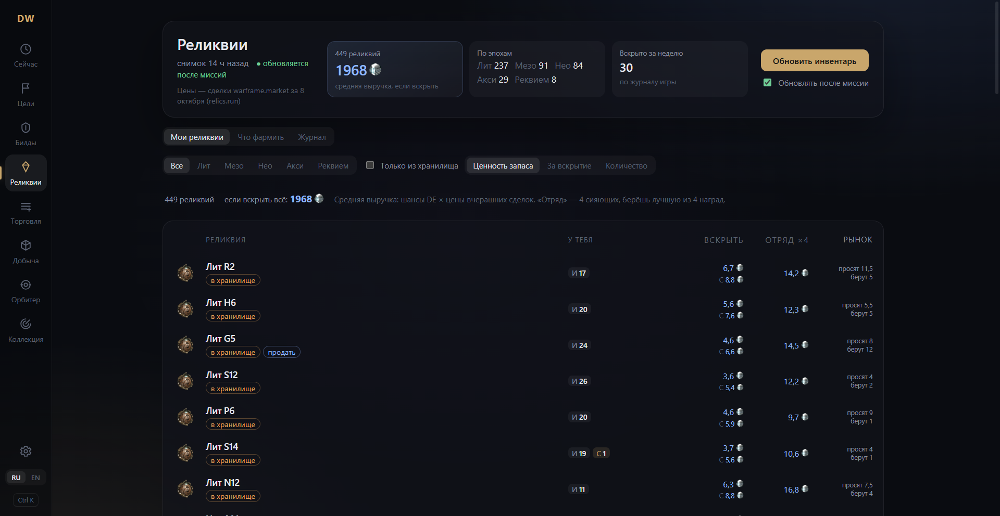
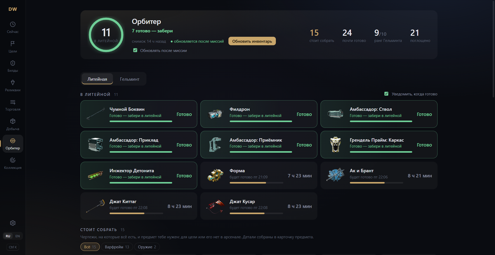
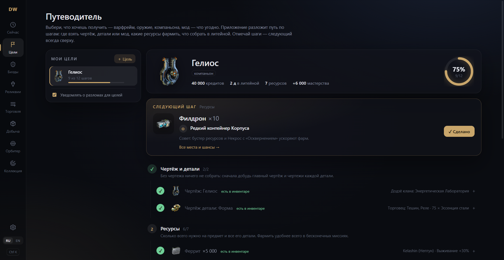
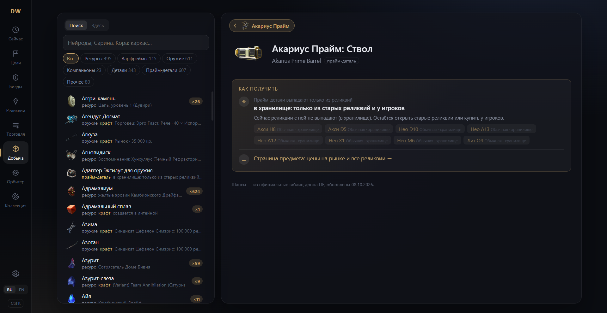
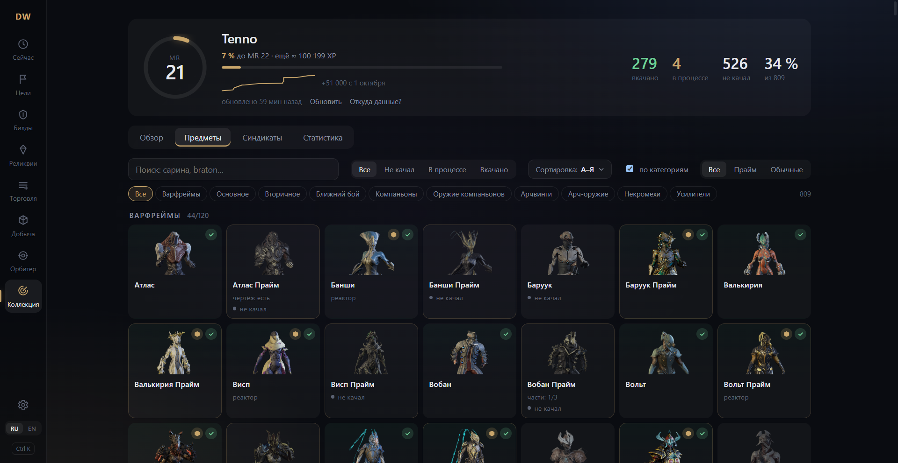

# DWCompanion

Компаньон для Warframe на русском языке. Бесплатный, с открытым кодом.

## Что умеет

- Показывает цены наград прямо на экране выбора реликвии
- Разломы, циклы, Баро и все таймеры мира в одном месте
- Билды для варфреймов, оружия, компаньонов, арчвингов и некрамехов
- Цены и ордера warframe.market, наборы, что выгодно продать
- Цели и подсказки, где что фармить
- Окно поверх игры по горячей клавише, чтобы не сворачиваться
- Уведомления о нужных разломах, Баро и готовых предметах в литейной

## Скриншоты

**Сейчас** — миссия и награды, разломы, циклы мира, Баро и всё, что есть на этой неделе: Нетра, Спуск, архонт, Цепь, календарь 1999, Ночная волна

**Билды** — конфигурации прямо из игры с осколками архонта и Гельминтом, статы и способности со сборкой, «Поделиться» кодом

**Реликвии** — что у тебя есть и сколько стоит вскрыть, отряд, журнал вскрытий

**Орбитер** — что строится в литейной, что можно собрать уже сейчас, Гельминт

**Цели** — путь к любому предмету по шагам: чертежи, детали, ресурсы, литейная

**Добыча** — где фармить любой ресурс, деталь или прайм-деталь

**Коллекция** — мастерство, что вкачано и что есть в арсенале

## Скачать

[Последняя версия](https://github.com/dragneel1230/DWCompanion/releases/latest), файл `DWCompanion_..._x64-setup.exe`.

Windows может предупредить о неизвестном издателе. Нажмите «Подробнее», затем «Выполнить в любом случае».
Дальше приложение обновляется само.

## Безопасность

Приложение не вмешивается в игру: ничего не внедряет, не меняет файлы игры и ничего не делает за вас.
Оно читает лог игры и экран наград, остальное берёт из открытых источников. Это соответствует правилам
Digital Extremes для сторонних программ.

Чтение инвентаря необязательное и выключено по умолчанию. Включить его можно в настройках, если захотите.

Весь код открыт, его можно проверить самому.

---

Проект не связан с Digital Extremes. Warframe является товарным знаком Digital Extremes Ltd.
